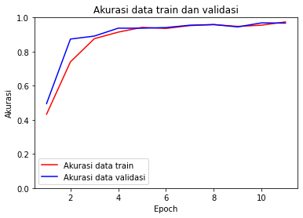
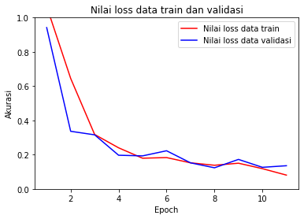

# Image Classification using Convolutional Neural Network (CNN)

**Description:** 
Image classification is a machine learning method that can be used to detect an image quickly. This project is about deciding whether an image is rock, paper, or scissors. The process model is implemented in a Python script that employs the TensorFlow library.

## Load the Data from the Data Set

In this article, we’ll take advantage of the [Rock-Paper-Scissors Images](https://www.kaggle.com/drgfreeman/rockpaperscissors) available from the Kaggle datasets. This data set contains image labeled with rock, paper, or scissors. The dataset contains a total of 2188 images corresponding to the 'Rock' (726 images), 'Paper' (710 images) and 'Scissors' (752 images) hand gestures of the Rock-Paper-Scissors game. All image are taken on a green background with relatively consistent ligithing and white balance. 

## Image Augmentation and Split the Data Set into a Training Set and a Validation Set

The code below shows the image augmentation process for each sample in the dataset using ImageDataGenerator function. Image augmentation is a technique for creating new data from existing data. An example of image augmentation is a horizontal flip where the image is flipped horizontally.[*](https://machinelearningmastery.com/image-augmentation-deep-learning-keras/) 

```py
train_datagen = ImageDataGenerator(
  rescale=1./255,
  rotation_range=20,
  horizontal_flip=True,
  shear_range = 0.2,
  fill_mode = 'nearest',
  validation_split=0.4)
```
In this example, the data set were divided  with the 60/40 pattern. It's mean that 60% of instances chosen randomly is used for training a model and the other 40% for its validation. 

## Build Convolutional Neural Network

Once the data is ready, we can build the architecture of a CNN. 

```py
model = Sequential([
  Conv2D(32, (3,3), activation='relu', input_shape=(150, 150, 3)),
  MaxPooling2D(2, 2),
  Conv2D(64, (3,3), activation='relu'),
  MaxPooling2D(2,2),
  Conv2D(128, (3,3), activation='relu'),
  MaxPooling2D(2,2),
  Conv2D(512, (3,3), activation='relu'),
  MaxPooling2D(2,2),
  Flatten(),
  Dropout(0.5),
  Dense(512, activation='relu'),
  Dense(3, activation='softmax')
])
```

## Define Callback

Use Early Termination to Stop Neural Network Training at the Right Time
Too many epochs can lead to overfitting of the training dataset, while too few can lead to model underfit. one way to prevent both is with early termination. this allows you to specify an arbitrary large number of training epochs and stop training once the model performance stops improving on a hold out validation dataset.[*](https://machinelearningmastery.com/how-to-stop-training-deep-neural-networks-at-the-right-time-using-early-stopping/)

```py
class Call(tf.keras.callbacks.Callback): 
  def on_epoch_end(self, epoch, logs={}): 
    if(logs.get('accuracy') > 0.96 and logs.get('val_accuracy') > 0.96):
      print("\nAccuration > 96%") 
      self.model.stop_training = True 
```
In this example, defined callback function stops after the accuracy of train and validation dataset greater than 96%.


## Train and Evaluate the Model

Before training the model, determine the loss function and optimizer to be used. In this example, categorical crossentrophy loss function and adam optimizer is used.

```py
model.compile(
  optimizer=keras.optimizers.Adam(learning_rate=0.001), 
  loss='categorical_crossentropy', 
  metrics=['accuracy']
)
```
After determining the loss function and optimizer on CNN, we can train our model using the fit method.

```py
history = model.fit(
  train_generator,
  steps_per_epoch=40,
  epochs=15,
  validation_data=validation_generator, 
  validation_steps=25,
  verbose=2,
  callbacks=[callbacks]
)
```
The training process displays the training and validation accuracy as well as the result of the callback function.

```
Epoch 1/15
40/40 - 88s - loss: 1.0653 - accuracy: 0.4328 - val_loss: 0.9417 - val_accuracy: 0.4950
Epoch 2/15
40/40 - 86s - loss: 0.6452 - accuracy: 0.7400 - val_loss: 0.3364 - val_accuracy: 0.8737
..
Epoch 11/15
40/40 - 85s - loss: 0.0806 - accuracy: 0.9744 - val_loss: 0.1353 - val_accuracy: 0.9675

Accuration> 96%
```

Training and validation accuracy reached 96.75% after 11 epochs.

## Accuration and Loss Plot

Then accuration and loss plot is made to make it easier to understand the data training process.



From the accuracy plot we can see that the model has been trained well because the accuracy graphs are close to each other. We can also see that the accuracy of the model in the next epoch will be close to the final accuracy, so early termination is useful to prevent overfitting.



From the plot of loss, we can see that the model has comparable performance on both train and validation datasets. If these parallel plots start to depart consistently, it might be a sign to stop training at an earlier epoch.

# Thank you for your visit! Wanna see another project of me? 
# Back to [my Portfolio](https://firdaanindita.github.io/)!


